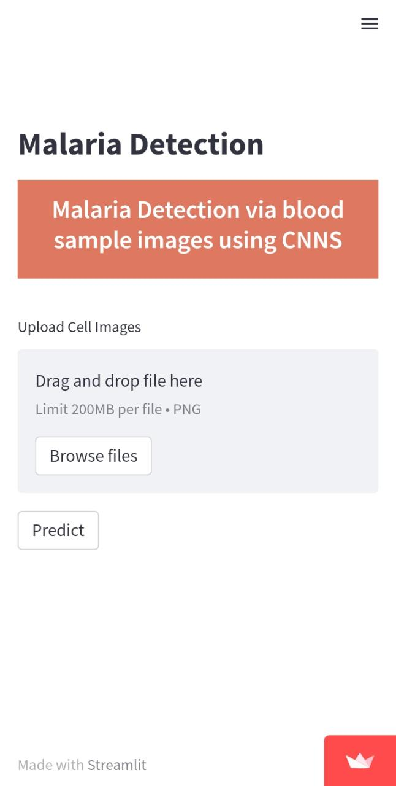
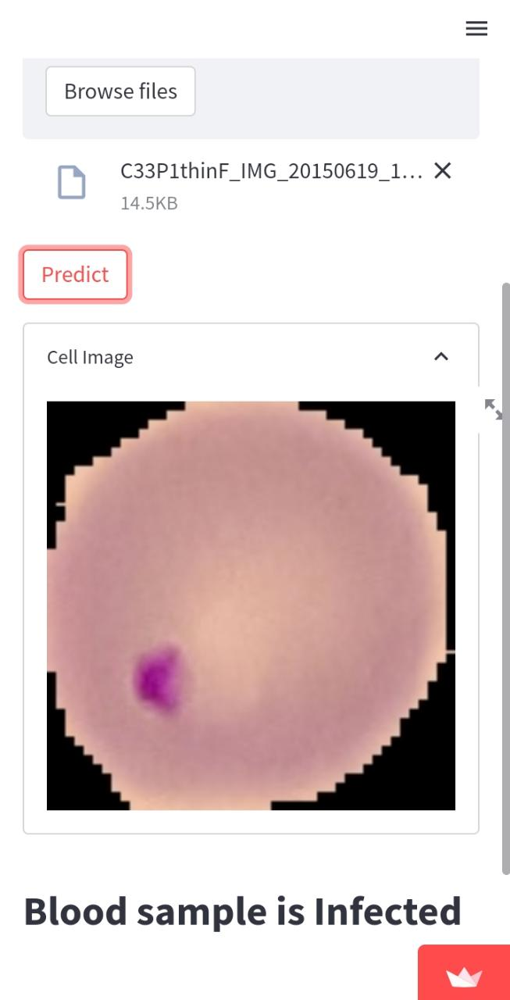
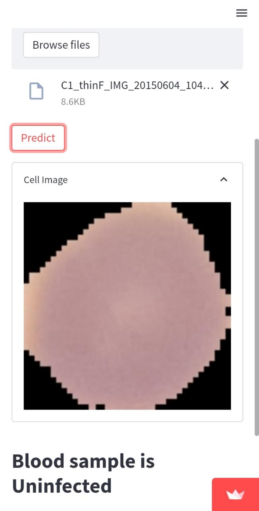

# malaria-detection-using-cnn
A project on the classification of blood sample images as infected for malaria parasites and Uninfected otherwise.

  
  
  

### Web App deployment: https://sushmita10062002-malaria-detection-using-cn-streamlitapp-u1ayly.streamlitapp.com/
